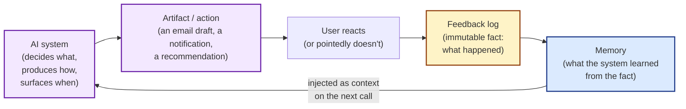

# Data Flow — 30,000 ft View

The feedback framework is a **closed loop**. Five conceptual stages. No technology yet.

**Color key:** purple boxes are **consumer territory** (your application — BEPA, your SaaS, etc.). Yellow + blue boxes are **framework territory**. Green-edged transitions between them are where the framework's API surface lives.

## The five stages

1. **AI system** decides what to work on, produces an artifact or takes an action, surfaces it through some channel at some time.
2. **Artifact / action** is what the user actually sees: a draft email, a Slack reply, a notification, a recommendation.
3. **User reacts** — clicks approve, edits, rejects, ignores, mutes, does the task themselves. _Inaction is a reaction too._
4. **Feedback log** records that reaction as an immutable fact. Append-only. The reaction is the event; it is not yet judged.
5. **Memory** is what the system derives from the log — example libraries, anti-pattern lists, timing windows, channel preferences. The next AI call reads from memory.

The loop closes because step 5 feeds step 1.

## Where each stage is implemented

The framework owns the middle of the loop (capture → log → memory). The two purple boxes (AI system, artifact) are **your code** — the framework provides ports and types but does not produce artifacts or call models.

| Stage                         | Owner                            | Key files / exports                                                                                                                                                                                                                                                                                                                                                                                                                                                                                                                                                                                                                                                                          | Notes                                                                                                                                                                                                                                                                                                                                                                               |
| ----------------------------- | -------------------------------- | -------------------------------------------------------------------------------------------------------------------------------------------------------------------------------------------------------------------------------------------------------------------------------------------------------------------------------------------------------------------------------------------------------------------------------------------------------------------------------------------------------------------------------------------------------------------------------------------------------------------------------------------------------------------------------------------- | ----------------------------------------------------------------------------------------------------------------------------------------------------------------------------------------------------------------------------------------------------------------------------------------------------------------------------------------------------------------------------------- |
| **AI system**                 | Consumer                         | n/a                                                                                                                                                                                                                                                                                                                                                                                                                                                                                                                                                                                                                                                                                          | The framework deliberately does not call models. The consumer holds the LLM client, the agent runtime, the prompt-building code. In BEPA, this is `src/ai/llm.ts`, `src/ai/capabilities/*`, `src/office/agents/*`.                                                                                                                                                                  |
| **Artifact / action**         | Consumer                         | n/a                                                                                                                                                                                                                                                                                                                                                                                                                                                                                                                                                                                                                                                                                          | The framework does not produce, render, or deliver artifacts. The consumer chooses how the artifact reaches the user (email, Slack, Telegram, push, web UI, etc.).                                                                                                                                                                                                                  |
| **User reacts** (capture)     | Framework + adapters             | Reference adapters: [`createHttpButtonCaptureAdapter`](packages/reference/src/capture-adapters/http-button.ts) for `POST /feedback/click` style endpoints; [`createWebhookCaptureAdapter`](packages/reference/src/capture-adapters/webhook.ts) for HMAC-signed inbound webhooks. Direct calls go through [`FeedbackPort.capture`](packages/core/src/ports/feedback-port.ts).                                                                                                                                                                                                                                                                                                                 | Custom transports (Telegram bot callback, SMS reply parser, IDE plugin) are written by the consumer and call `feedback.capture(input)`. The framework supplies the contract, not the wire.                                                                                                                                                                                          |
| **Feedback log** (write path) | Framework                        | Entry: [`createFeedback`](packages/core/src/create-feedback.ts) wires everything. The capture call walks the middleware pipeline ([`packages/core/src/middleware/`](packages/core/src/middleware/)), runs [`classify`](packages/core/src/classifier.ts) + [`evaluateRules`](packages/core/src/inference-engine.ts), then commits via [`EventStorePort.append`](packages/core/src/ports/event-store-port.ts). Schema is [`FeedbackEventSchema`](packages/core/src/event-types.ts). Schema evolution is handled by [`upcastEvent` / `upcastStream`](packages/core/src/upcaster.ts).                                                                                                            | Storage backends: in-memory ([`createInMemoryEventStore`](packages/in-memory/src/event-store.ts)) for tests, Postgres ([`createPostgresEventStore`](packages/postgres/src/event-store.ts)) for production. Transactional outbox lives next to the log: [`createPostgresOutbox`](packages/postgres/src/outbox.ts) + [`startOutboxScanner`](packages/postgres/src/outbox-scanner.ts). |
| **Memory** (derived state)    | Framework + reference + consumer | Engine: [`ProjectionEngine` / `ProjectionBuilder`](packages/core/src/projection-engine.ts). Storage: [`ProjectionStorePort`](packages/core/src/ports/projection-store-port.ts) — in-memory ([`createInMemoryProjectionStore`](packages/in-memory/src/projection-store.ts)) or Postgres ([`createPostgresProjectionStore`](packages/postgres/src/projection-store.ts)). Reference projections to learn from: [`approvalRateProjection`](packages/reference/src/projections/approval-rate.ts), [`createWhitelistExamplesProjection`](packages/reference/src/projections/whitelist-examples.ts), [`createBlacklistPhrasesProjection`](packages/reference/src/projections/blacklist-phrases.ts). | Consumers register their own `ProjectionBuilder`s via the `projections` option in `createFeedback`. Each builder is a pure `(event, currentState) -> nextState` function.                                                                                                                                                                                                           |
| **→ injected as context**     | Consumer                         | The consumer reads from the projection store via [`feedback.queryProjection`](packages/core/src/ports/feedback-port.ts) and stitches results into the next prompt. The framework does not auto-inject; it gives you the data and stays out of the prompt-engineering business.                                                                                                                                                                                                                                                                                                                                                                                                               | In BEPA, this is `src/office/learning/` reading projection rows and `src/ai/capabilities/draft.ts` injecting them into the system prompt.                                                                                                                                                                                                                                           |

**Composition glue.** [`createFeedback({ eventStore, projectionStore, eventBus?, outbox?, inferenceRules?, actions, artifactTypes, projections, captureMiddleware?, publishMiddleware?, upcasters? })`](packages/core/src/create-feedback.ts) is the single factory that wires every box together. Swap any port, register a new projection, change the bus — the wiring changes; the conceptual loop does not.

## Why this shape matters

- **The log is the source of truth.** Memory is derived. If a learning rule changes, you rebuild memory by replaying the log. No data migration.
- **One reaction can update multiple memories.** A user editing a draft says something about _what was selected_ (probably the right task), _how it was done_ (the artifact needed correction), and _when it surfaced_ (timing was probably fine). The framework lets one event contribute to all three memories.
- **No model retraining.** The model weights never change. Only the context injected on the next call changes. That keeps the system debuggable and provider-portable.

## What is deliberately not in this diagram

- Capture mechanism (button click vs webhook vs SMS) — that's an adapter detail.
- Storage technology (Postgres, Redis, in-memory) — that's a port choice.
- Synchronous vs asynchronous projection updates — that's a delivery detail.
- Outbox, bus, scanner, transport guarantees — all plumbing.

Those drill into level 2 and below. This diagram is the lens; everything else is implementation.

---

Next zoom levels (when you're ready):

- **Level 2 — what's inside each stage?** What does "User reacts" actually emit? What does "Memory" actually contain?
- **Level 3 — how do the pieces compose at runtime?** The capture path, dispatch path, replay path.
- **Level 4 — wiring diagrams for specific adapter combinations.**

Tell me which level to draw next.
